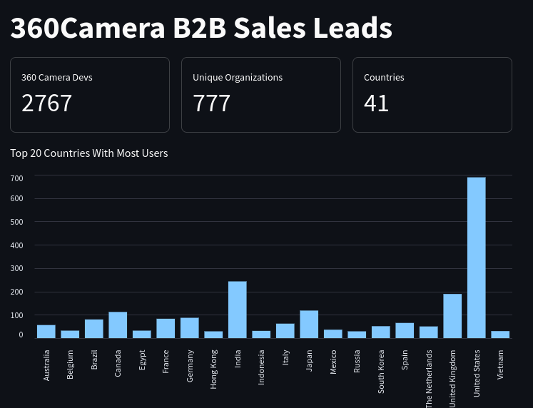
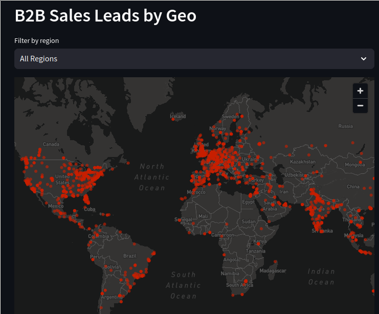

# 360 Camera B2B Sales Lead Analysis

Using streamlit

## Install

1. Create and activate virtual environment

```bash
python -m venv venv
source venv/bin/activate  # On Windows use: venv\Scripts\activate
```

2. Install requirements

```bash
pip install -r requirements.txt
```

## Run

```
streamlit run app.py
```

## Features Gallery




